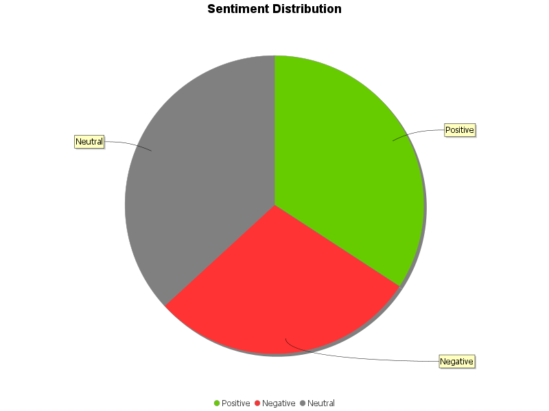
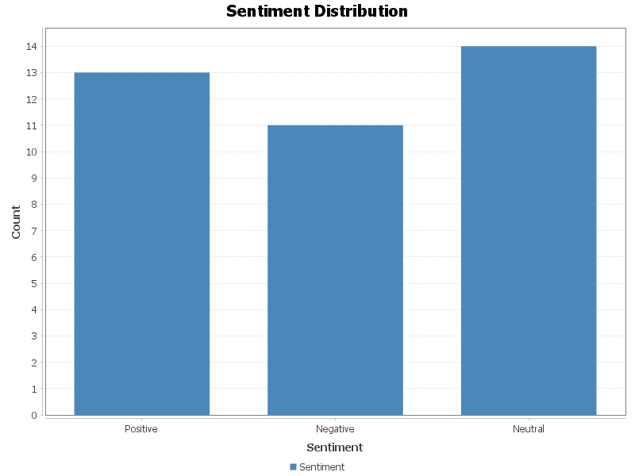

# Sentiment Analyzer 

A Java-based sentiment analysis project that processes textual reviews, analyzes their sentiment, and visualizes the results with beautiful charts.


##  What does this project do?

- Reads customer reviews from `reviews.txt`
- Uses **Stanford CoreNLP** to detect the sentiment (Positive / Negative / Neutral)
- Saves the results to a `results.csv` file
- Generates two charts:
  -  **Pie Chart** – shows sentiment distribution
  -  **Bar Chart** – compares sentiment counts

---

##  Technologies & Tools

- Java 17
- Maven
- Stanford CoreNLP
- JFreeChart
- IntelliJ IDEA

---

##  Example Output

### Pie Chart



### Bar Chart


> Charts are saved automatically under the `charts/` folder upon running the program.

---

##  How to Run

1. Add your reviews to the file: `texts/reviews.txt` (one review per line)
2. Run the file `SentimentAnalyzer.java`
3. Output:
   - `results.csv` – with the sentiment for each review
   - PNG charts – saved with timestamps under `charts/`

---

##  Project Structure

```
sentiment-analyzer/
├── texts/
│   ├── reviews.txt
│   └── results.csv
├── charts/
│   ├── sentiment_YYYY-MM-DD_HH-MM.png
│   └── sentiment_bar_YYYY-MM-DD_HH-MM.png
├── src/main/java/com/sentiment/app/
│   ├── SentimentAnalyzer.java
│   ├── SentimentChartGenerator.java
│   └── App.java
├── pom.xml
└── README.md
```

---

##  Recommended .gitignore

```
.idea/
target/
*.class
*.png
results.csv
```

---

##  Why it's great for your portfolio

- Combines **NLP (Natural Language Processing)** with **Data Analysis**
- Includes **data visualization** and **CSV handling**
- Demonstrates strong Java skills and library integration
- Clear, clean, and production-ready code

---

##  Created by

[Shahar Moskovics] – Industrial And Management Engineering Student | Aspiring Data Analyst  
 Tel Aviv, Israel  
shaharmos1@gmail.com | http://www.linkedin.com/in/shahar-moskovics
